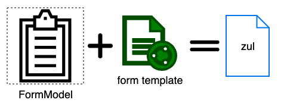
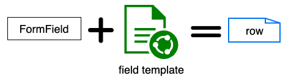

# form builder

A demo project for the form builder smalltalk

## Goal
Given raw data, we want to create simple input-and-save forms without manually writing each field in zul or java.

## Scope
This project is both a POC and a demo project used with the ZK training "automated form creation"

# How to run
`mvn jetty:run`

visit `http://localhost:8080/formbuilder/`

# Main Idea
Provide `FormbuilderModel` to store a form structure and produce a zul content based on the structure.

# Build
`mvn clean package`